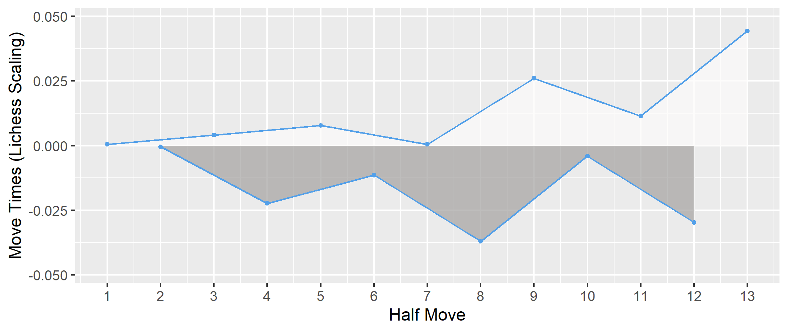
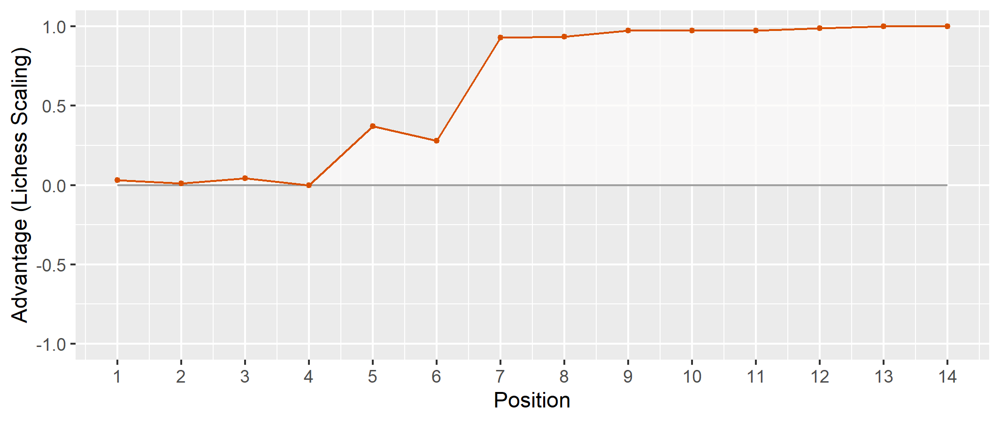
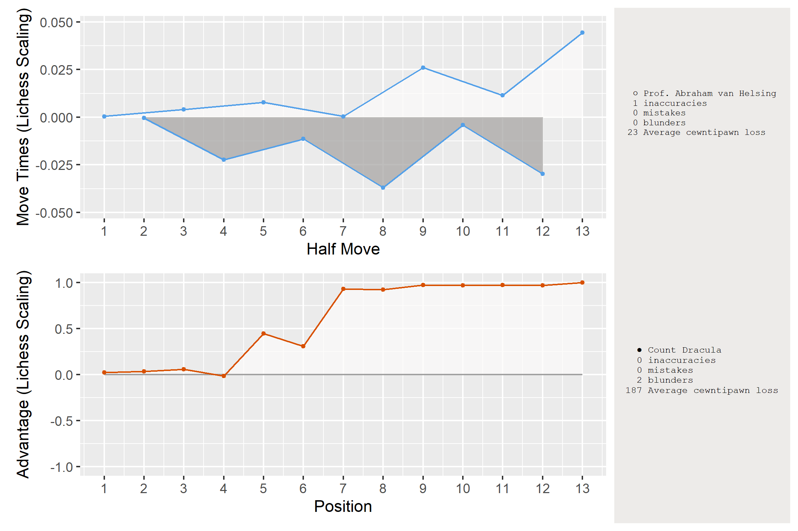

<!-- README.md is generated from README.Rmd. Please edit that file -->

# rbitr 

<!-- badges: start -->
<!-- badges: end -->

Arbiter: One who ensures adherence to the rules and laws of chess

## Installation

You can install the beta version of rbitr from github with:

``` r
devtools::install_github("dryguy/rbitr")
```

### Introduction

rbitr is a an R package for analyzing chess games, with emphasis on
generating game statistics that may be useful for the detection of
illicit computer assistance.

For game analysis, rbitr relies on an external chess engine.
Communication between rbitr and the chess engine is done via the
[Universal Chess Interface
Protocol](http://wbec-ridderkerk.nl/html/UCIProtocol.html), so a chess
engine that is compatible with the UCI protocol is required to use many
of rbitr’s functions. rbitr was developed using the [Stockfish
13](https://stockfishchess.org/) chess engine running in Windows. It has
currently only been tested in Windows with the following Stockfish
engines:

    stockfish_20090216_x64_bmi2.exe
    stockfish_13_win_x64_bmi2.exe
    stockfish_14_x64_avx2.exe
    stockfish_14.1_win_x64_avx2.exe
    stockfish_15_x64_avx2.exe
    stockfish-windows-2022-x86-64-avx2.exe

Other UCI-compatible engines should also work, but your mileage may
vary.

A big thanks is due to Wojciech Rosa for creating the package
[bigchess](https://github.com/rosawojciech/bigchess). rbitr depends on
bigchess to handle the interface between R and the chess engine. It is
unlikely that rbitr would exist without it.

Once you have installed rbitr and are ready to begin, simply load the
package.

``` r
library(rbitr)
```

### Importing Games From PGN Files

Chess games stored in the Portable Game Notation (PGN) format can easily
be imported into R using the function `get_pgn()`.

A chess game stored in a PGN file looks something like this:

    [Event "Casual Game"]
    [Site "Arctic Ocean"]
    [Date "17-"]
    [Round "?"]
    [White "Victor Frankenstein"]
    [Black "'Adam'"]
    [Result "0-1"]

    1. f3 e6 2. g4 Qh4#

The data in brackets are known as tag pairs, and the first word in each
bracket is the tag name. Below the tags is the “movetext” section.

rbitr stores chess games as
[tibbles](https://github.com/tidyverse/tibble). The main reason for this
is that the moves of longer chess games can make the onscreen display of
a data frame rather unwieldy, whereas tibbles are designed to provide a
nice orderly display. With `get_pgn()`, each game in a PGN file will
become a row in a tibble, each tag will become a column, and each tag
name will become a column name. The moves become an additional column
named “Movetext”. Tibbles or data frames in this format may be saved as
PGN files with the function `save_pgn()`.

A few example PGN files have been included with the rbitr package.
Here’s an example showing how to import a PGN file containing two short
games.

``` r
two_games_path <- file.path(
  system.file(package = 'rbitr'),
  'extdata',
  'two_games.pgn'
)
get_pgn(two_games_path)
#> # A tibble: 2 × 8
#>   Event       Site                  Date       Round White  Black Result Movet…¹
#>   <chr>       <chr>                 <chr>      <chr> <chr>  <chr> <chr>  <chr>  
#> 1 Casual Game 221B Baker Street     1887.04.01 ?     Sherl… John… 1-0    1. e4 …
#> 2 Casual Game Not in Kansas Anymore 1900.05.17 ?     Scare… Osca… 1-0    1. e4 …
#> # … with abbreviated variable name ¹​Movetext
```

PGN files often contain more data than the simple examples just shown.
For example, PGN files of online games may store clock data for timed
games, or game analyses by chess engines. Here’s an example from a PGN
file containing both of these types of data.

``` r
pgn_path <- file.path(
  system.file(package = 'rbitr'),
  'extdata',
  'short_game.pgn'
)
pgn <- get_pgn(pgn_path)
strwrap(pgn$Movetext, 70)
#> [1] "1. e4 { [%eval 0.05] [%clk 0:05:00] } 1... e5 { [%eval 0.21] [%clk"   
#> [2] "0:05:00] } 2. d4 { [%eval 0.0] [%clk 0:05:07] } 2... f6 { [%eval"     
#> [3] "1.94] [%clk 0:05:02] } 3. dxe5 { [%eval 1.43] [%clk 0:05:13] } 3..."  
#> [4] "fxe5 { [%eval 8.27] [%clk 0:05:07] } 4. Qh5+ { [%eval 8.55] [%clk"    
#> [5] "0:05:21] } 4... Ke7 { [%eval 10.78] [%clk 0:05:05] } 5. Qxe5+ {"      
#> [6] "[%eval 10.82] [%clk 0:05:22] } 5... Kf7 { [%eval 10.94] [%clk"        
#> [7] "0:05:12] } 6. Bc4+ { [%eval 12.62] [%clk 0:05:27] } 6... Kg6 { [%eval"
#> [8] "#1] [%clk 0:05:12] } 7. Qf5# { [%clk 0:05:23] } 1-0"
```

We’ll examine how to extract this data in the next section.

To learn more about the PGN format, see the [PGN
Specification](http://www.saremba.de/chessgml/standards/pgn/pgn-complete.htm)
and the [PGN Specification
Supplement](http://www.enpassant.dk/chess/palview/enhancedpgn.htm).

(Note that `get_pgn()` and `save_pgn()` are fairly bare-bones functions.
They have no options to control which tags are read/written, and have no
support for large PGN files. For a PGN management in R with more
features, check out `bigchess::read.pgn()` and `bigchess::write.pgn()`.)

### Extracting Data From Imported PGN Files

As we saw in the last section, PGN files may store commentary,
annotations, clock data, engine analysis, or other content interspersed
among the moves of the game. In this section, we’ll examine ways to
extract some of this data.

rbitr has two ways to extract the moves of a game that has been imported
from a PGN file. The function `clean_movetext()` removes any comments,
annotations, embedded data, or extra white space, leaving just the moves
and the move numbers. PGN files store moves in standard algebraic
notation (SAN), so the end result after using `clean_movetext()` is in a
format easily read by most human chess players.

``` r
movetext <- clean_movetext(pgn$Movetext)
movetext
#> [1] "1. e4 e5 2. d4 f6 3. dxe5 fxe5 4. Qh5+ Ke7 5. Qxe5+ Kf7 6. Bc4+ Kg6 7. Qf5#"
```

Communicating chess moves to a chess engine through the UCI interface
requires a different format know as long algebraic notation (LAN). This
format is somewhat less readable for humans, since it leaves out move
numbers and does not use letters or symbols to identify the pieces. The
function `get_moves()` removes everything that `clean_movetext()`
removes, but also removes move numbers, splits the moves, and converts
them to LAN format. (The conversion to LAN is done behind the scenes
using the function bigchess::san2lan().)

``` r
moves <- get_moves(pgn$Movetext)
moves
#> [[1]]
#>  [1] "e2e4" "e7e5" "d2d4" "f7f6" "d4e5" "f6e5" "d1h5" "e8e7" "h5e5" "e7f7"
#> [11] "f1c4" "f7g6" "e5f5"
```

rbitr can also extract the times or the evaluations using `get_clocks()`
or `get_evals()`.

``` r
clocks <- get_clocks(pgn$Movetext)
clocks
#> [[1]]
#>  [1] 300 300 307 302 313 307 321 305 322 312 327 312 323
evals <- get_evals(pgn$Movetext)
evals
#> [[1]]
#>  [1]     5    21     0   194   143   827   855  1078  1082  1094  1262 50000
```

Note that the clock data has been converted from minutes to seconds, and
the evaluations have been converted from pawns to centipawns.

Having the clock data is nice, but what we usually care about is the
time taken for each move. To calculate this, we need to know if the time
control for the game included an increment, so we’ll look at the
TimeControl tag from the PGN file.

``` r
pgn$TimeControl
#> [1] "300+8"
```

We can see that in this case, the time control was 300 seconds plus an
additional 8 seconds per move. For PGN files with a lot of games, it is
convenient to be able to extract the increments using the function
`get_incrememnts()`. Here there’s just one game, but we’ll demonstrate
the use of `get_increments()` anyway.

``` r
increments <- get_increments(pgn$TimeControl)
increments
#> [1] 8
```

Once we have that in hand, it is now possible to calculate the move
times using `get_move_times()`.

``` r
white_move_times <- get_move_times(clocks[[1]], increments[[1]], 'white')
white_move_times
#> [1]  0  1  2  0  7  3 12
black_move_times <- get_move_times(clocks[[1]], increments[[1]], 'black')
black_move_times
#> [1]  0  6  3 10  1  8
```

Note that since the PGN file can contain more than one game, `clocks`
and `increments` are returned as lists. Since we are dealing with the
first (and only) game in this PGN file, we had to specify the first
elements of `clocks` and `increments` when calling `get_move_times()`.

There is some variation in how clocks are treated when it comes to each
player’s first move. According to FIDE’s [laws of
chess](https://www.fide.com/FIDE/handbook/LawsOfChess.pdf), white’s
clock is started before white plays their first move. On the website
lichess.org, neither player’s clock starts until after they play their
first move (i.e., each player’s first move is counted as 0 seconds).
rbitr currently follows the convention that each player’s first move
counts as 0 seconds.

### Plotting Move Times

To visualize move times over the course of the game, rbitr borrows a
scaling function from the website [lichess.org](lichess.org). The
logarithmic scaling function for [move
times](https://lichess.org/blog/WOEVrjAAALNI-fWS/a-better-game-clock-history)
ensures that rapid moves made in long games don’t disappear into the
baseline of the plot. This same scaling function is available in rbitr’s
`time_plot()`.

``` r
time_plot(white_move_times, black_move_times)
```



In chess, each time a player moves a piece is considered a “half-move”.
So, in the strictest sense, anywhere we’ve said “move time”, we’ve
actually been referring to “half-move times”, and the x-axis on the time
plot is given in half-moves. The plot begins with white’s first
half-move, and black’s half-move times are plotted with the opposite
sign of white’s.

### Plotting Evaluations

An engine’s evaluation of the positions in a game may be plotted using
the function `advantage_plot()`.

When plotting engine evaluations, it can be useful to apply a scaling
function, because the players may place less value on material in
proportion to how imbalanced the position is. In other words, losing a
pawn when you are up a queen has much less impact on your game than it
does when material is even. To reflect this, the `scaling` parameter for
`advantage_plot()` can be used to apply the same scaling function used
by
[lichess](https://lichess.org/blog/WFvLpiQAACMA8e9D/learn-from-your-mistakes),
or it can apply a
[different](https://www.aaai.org/ocs/index.php/AAAI/AAAI11/paper/view/3779)
scaling [function](https://doi.org/10.1007/978-3-642-31866-5_20)
developed by Prof. Ken Regan at the University of Buffalo. The function
`advantage_plot()` plots an engine’s evaluations of the game’s positions
after applying the chosen scaling function. Lichess scaling is currently
the default.

Before making an advantage plot, there is one wrinkle to address. A
chess engine will provide an evaluation for each position in a chess
game, including the first position, and also for mated positions (where
the evaluation is ‘mate 0’). PGN files do not generally store an
engine’s evaluation of the first position. If desired, this initial
evaluation can be supplied to the `get_evals()` function so that the
output is in sync with what an engine would produce. Also, `get_evals()`
will only provide a centipawn value for the final mated position if the
`mate0` parameter is set to TRUE.

``` r
evals <- get_evals(pgn$Movetext, first_eval = 15, mate0 = TRUE)
advantage_plot(evals[[1]])
```



The sign convention used here is that positive evaluations mean that
white has the advantage, while negative evaluations mean that black has
the advantage. The x-axis is numbered starting with 1 for the first
evaluation that was supplied (in this case, for the initial position).
There is one more position than there were half-moves, as expected,
since half-moves can only occur in between adjacent positions.

Notice that we had to specify that we want the evaluations for game 1,
because like `get_clocks()` and `get_increments()`, the function
`get_evals()` returns a list of results, with each list entry
corresponding to a different game in the original PGN file.

### Analyzing Games Using an External Chess Engine

Next, we’ll look at how to analyze games using an external chess engine.
To analyze games, we’ll use the function `evaluate_game()`. In order to
use the function, you will need to provide the path to the engine you’ll
be using for the game analysis. In the next line of code, you’ll need to
change the path as required by your engine location and operating
system.

``` r
engine_path <- '//stockfish.exe'
```

Depending on your processor speed, this step may take some time. If you
have more than one CPU, you can speed up the analysis by changing the
`n_cpus` parameter. In this example, the default setting of `n_cpus` = 1
is used. We will set the `mute` parameter to `FALSE` to show the
progress of the analysis. The search termination can be controlled by
limiting the depth, by limiting the total number of positions or ‘nodes’
evaluated, or by limiting the time. Here we will set the `limiter`
parameter to ‘nodes’, and set the `limit` parameter to 2250000.

``` r
gamelog <- evaluate_game(pgn$Movetext[[1]], engine_path, limiter = 'nodes',
                         limit = 2250000, mute = FALSE)
#> [1] "Analyzing position 1 of 14"
#> [1] "Analyzing position 2 of 14"
#> [1] "Analyzing position 3 of 14"
#> [1] "Analyzing position 4 of 14"
#> [1] "Analyzing position 5 of 14"
#> [1] "Analyzing position 6 of 14"
#> [1] "Analyzing position 7 of 14"
#> [1] "Analyzing position 8 of 14"
#> [1] "Analyzing position 9 of 14"
#> [1] "Analyzing position 10 of 14"
#> [1] "Analyzing position 11 of 14"
#> [1] "Analyzing position 12 of 14"
#> [1] "Analyzing position 13 of 14"
#> [1] "Analyzing position 14 of 14"
gamelog[[1]]
#>  [1] "Stockfish 15.1 by the Stockfish developers (see AUTHORS file)"                                                                                                                                                                       
#>  [2] "readyok"                                                                                                                                                                                                                             
#>  [3] "readyok"                                                                                                                                                                                                                             
#>  [4] "info string NNUE evaluation using nn-ad9b42354671.nnue enabled"                                                                                                                                                                      
#>  [5] "info depth 1 seldepth 1 multipv 1 score cp 18 nodes 20 nps 10000 hashfull 0 tbhits 0 time 2 pv e2e4"                                                                                                                                 
#>  [6] "info depth 2 seldepth 2 multipv 1 score cp 46 nodes 66 nps 33000 hashfull 0 tbhits 0 time 2 pv d2d4"                                                                                                                                 
#>  [7] "info depth 3 seldepth 2 multipv 1 score cp 51 nodes 120 nps 60000 hashfull 0 tbhits 0 time 2 pv e2e4"                                                                                                                                
#>  [8] "info depth 4 seldepth 2 multipv 1 score cp 58 nodes 144 nps 72000 hashfull 0 tbhits 0 time 2 pv d2d4"                                                                                                                                
#>  [9] "info depth 5 seldepth 2 multipv 1 score cp 58 nodes 174 nps 87000 hashfull 0 tbhits 0 time 2 pv d2d4 a7a6"                                                                                                                           
#> [10] "info depth 6 seldepth 7 multipv 1 score cp 34 nodes 1303 nps 434333 hashfull 0 tbhits 0 time 3 pv e2e4 c7c5 g1f3 b8c6 c2c3"                                                                                                          
#> [11] "info depth 7 seldepth 6 multipv 1 score cp 29 nodes 3126 nps 521000 hashfull 1 tbhits 0 time 6 pv d2d4 g8f6 e2e3 d7d5 c2c4 d5c4"                                                                                                     
#> [12] "info depth 8 seldepth 7 multipv 1 score cp 26 nodes 5791 nps 723875 hashfull 4 tbhits 0 time 8 pv g1f3 g8f6 d2d4 d7d5 e2e3"                                                                                                          
#> [13] "info depth 9 seldepth 9 multipv 1 score cp 31 nodes 8541 nps 854100 hashfull 5 tbhits 0 time 10 pv g1f3 c7c5 e2e4 e7e6 d2d4 c5d4 f3d4"                                                                                               
#> [14] "info depth 10 seldepth 13 multipv 1 score cp 25 nodes 20978 nps 998952 hashfull 10 tbhits 0 time 21 pv e2e4 c7c5 g1f3 b8c6 f1c4 e7e6 e1g1 g8f6"                                                                                      
#> [15] "info depth 11 seldepth 13 multipv 1 score cp 32 nodes 29040 nps 1037142 hashfull 14 tbhits 0 time 28 pv e2e4 c7c5 c2c3 g8f6 e4e5 f6d5 d2d4"                                                                                          
#> [16] "info depth 12 seldepth 14 multipv 1 score cp 38 nodes 41207 nps 1084394 hashfull 18 tbhits 0 time 38 pv e2e4 e7e6 d2d4 d7d5 b1c3 d5e4 c3e4"                                                                                          
#> [17] "info depth 13 seldepth 15 multipv 1 score cp 31 nodes 60308 nps 1116814 hashfull 25 tbhits 0 time 54 pv e2e4 c7c5 g1f3 d7d6 d2d4 c5d4 f3d4 b8c6 c1e3 g8f6 b1c3 g7g6"                                                                 
#> [18] "info depth 14 seldepth 18 multipv 1 score cp 35 nodes 97789 nps 1098752 hashfull 44 tbhits 0 time 89 pv d2d4 g8f6 c2c4 e7e6 g1f3 d7d5 g2g3 f8e7 b1c3 c7c5"                                                                           
#> [19] "info depth 15 seldepth 21 multipv 1 score cp 31 nodes 142447 nps 1071030 hashfull 64 tbhits 0 time 133 pv d2d4 g8f6 c2c4 e7e6 g1f3 d7d5 c1g5 f8e7 b1c3 e8g8 e2e3 h7h6 g5h4 f6e4 h4e7 d8e7"                                           
#> [20] "info depth 16 seldepth 21 multipv 1 score cp 40 nodes 199887 nps 1063228 hashfull 88 tbhits 0 time 188 pv d2d4 d7d5 c2c4 d5c4 g1f3 a7a6 b1c3 c7c6 a2a4"                                                                              
#> [21] "info depth 17 seldepth 19 multipv 1 score cp 32 nodes 268004 nps 1063507 hashfull 120 tbhits 0 time 252 pv d2d4 g8f6 c2c4 e7e6 g2g3 d7d5 g1f3 f8e7 f1g2 e8g8 e1g1 c7c5 c4d5 e6d5 b1c3 h7h6 d4c5 e7c5"                                
#> [22] "info depth 18 seldepth 21 multipv 1 score cp 29 nodes 298071 nps 1072197 hashfull 131 tbhits 0 time 278 pv d2d4 g8f6 c2c4 e7e6 g2g3 d7d5 g1f3 f8e7 f1g2 e8g8 e1g1 c7c5 c4d5 e6d5 c1g5 b8c6 d4c5 e7c5 g5f6 d8f6"                      
#> [23] "info depth 19 seldepth 25 multipv 1 score cp 28 nodes 332202 nps 1078577 hashfull 142 tbhits 0 time 308 pv d2d4 g8f6 c2c4 e7e6 g1f3 d7d5 c1g5 f8e7 b1c3 e8g8 e2e3 h7h6 g5f4 c7c5 d4c5 e7c5 c4d5 f6d5 c3d5 e6d5"                      
#> [24] "info depth 20 seldepth 23 multipv 1 score cp 37 nodes 557706 nps 1068402 hashfull 243 tbhits 0 time 522 pv d2d4 g8f6 c2c4 e7e6 g2g3 d7d5 f1g2 f8e7 g1f3 e8g8 e1g1 d5c4 d1a4 a7a6 a4c4 b7b5 c4c2 c8b7 c1f4 f6d5"                      
#> [25] "info depth 21 seldepth 23 multipv 1 score cp 31 nodes 753633 nps 1061454 hashfull 326 tbhits 0 time 710 pv d2d4 g8f6 c2c4 g7g6 b1c3 d7d5 g1f3 f8g7 c4d5 f6d5 e2e4 d5c3 b2c3 c7c5 c1e3 c5d4 c3d4 e8g8 f1c4 c8g4 e1g1"                 
#> [26] "info depth 22 seldepth 28 multipv 1 score cp 29 nodes 1197489 nps 1070142 hashfull 487 tbhits 0 time 1119 pv d2d4 d7d5 c2c4 e7e6 b1c3 f8b4 e2e3 g8f6 d1a4 b8c6 c1d2 c8d7 a4c2 e8g8 g1f3 d5c4 f1c4"                                   
#> [27] "info depth 23 seldepth 27 multipv 1 score cp 30 nodes 1586189 nps 1058871 hashfull 610 tbhits 0 time 1498 pv d2d4 d7d5 c2c4 e7e6 g1f3 g8f6 g2g3 f8e7 f1g2 e8g8 e1g1 d5c4 d1a4 a7a6 a4c4 b7b5 c4c2 c8b7 c1f4 c7c5 d4c5 b8d7 b2b4 a6a5"
#> [28] "info depth 24 seldepth 29 multipv 1 score cp 25 upperbound nodes 2250166 nps 1049028 hashfull 770 tbhits 0 time 2145 pv d2d4 d7d5"                                                                                                   
#> [29] "bestmove d2d4 ponder d7d5"
```

The result of the analysis is a list of raw chess engine output for each
position in the game. The output can get to be quite verbose; we’ve only
displayed the output for the first position, and it’s already quite
long. We see the name of the engine that was used, some messages that
the engine was ready, a line telling us that the engine-specific NNUE
option was turned on, and a number of lines showing evaluations at
various depths. The last line tells us the best move that was found, and
the move that the engine would “ponder” on the opponent’s time, if it
was in a game. We’ll show how to extract the data we want from the
engine output in the next section.

(Note that the `evaluate_game()` and `parse_gamelog()` functions
essentially duplicate features that are available in the bigchess
package. I overlooked the existence of those features, and wound up
writing my own code, thus proving that “weeks of coding will save you
hours of planning.” The silver lining is that, for whatever reason,
`evaluate_game()` runs about 3-4 times faster than
`bigchess::analyze_game()` so I’ve kept it in. There’s a number of other
places where rbitr’s features overlap with bigchess, but those are more
deliberate decisions having to do with creating the types of work flow
that I wanted for rbitr.)

Batch analysis of games is also possible using the function
`evaluate_pgn()`, which is essentially a fancy wrapper for
`evaluate_game()`. The results of `evaluate_pgn()` are not saved to disk
by default. However, deep analysis of large number of games can take a
*very* long time. It is highly recommended to set the `save_logs`
parameter to `TRUE`. That way, if the analysis has to be interrupted,
you will not lose what could be many hours of analysis, and can resume
the analysis later, if desired. The analyses will be saved to a
directory with the same base name as the PGN file.

``` r
pgnlog <- evaluate_pgn(two_games_path, engine_path,
                       limiter = 'nodes', limit = 2250000)
#> [1] "game 1 of 2"
#> [1] "estimated time remaining 9 secs"
#> [1] "game 2 of 2"
#> [1] "estimated time remaining 0 secs"
```

### Extracting Data From Chess Engine Logs

The `parse_gamelog()` function can extract evaluations (‘score’), the
best moves the engine found (‘bestmove’), or the principal variations
(‘pv’).

``` r
bestmoves <- unlist(parse_gamelog(gamelog, 'bestmove'))
bestmoves
#>  [1] "d2d4" "c7c5" "g1f3" "e5d4" "f1c4" "b8c6" "d1h5" "g7g6" "h5e5" "e7f7"
#> [11] "f1c4" "d7d5" "e5f5" ""
scores <- unlist(parse_gamelog(gamelog, 'score'))
scores
#>  [1] "25"     "-42"    "43"     "29"     "154"    "-133"   "570"    "-575"  
#>  [9] "737"    "-750"   "741"    "-770"   "mate 1"
pvs <- unlist(parse_gamelog(gamelog, 'pv'))
pvs
#>  [1] "d2d4 d7d5"                                                                                                                                                                     
#>  [2] "c7c5 g1f3 b8c6 d2d4 c5d4 f3d4 g7g6 b1c3 f8g7 c1e3 g8f6 d4c6 b7c6 e4e5 f6g8 f2f4 d7d6 d1d2 g8h6 e1c1 c8g4 f1e2 e8g8 c1b1 g4e2"                                                  
#>  [3] "g1f3 b8c6 f1b5 g8f6 e1g1 f6e4 f1e1 e4d6 f3e5 f8e7 b5f1 c6e5 e1e5 e8g8 d2d4 e7f6 e5e1 f8e8 e1e8 d6e8 d4d5 b7b6 a2a4 f6e5 c2c4 c8b7 b1c3"                                        
#>  [4] "e5d4"                                                                                                                                                                          
#>  [5] "f1c4"                                                                                                                                                                          
#>  [6] "b8c6"                                                                                                                                                                          
#>  [7] "d1h5 g7g6 h5e5 d8e7 e5h8 d7d5 g1f3 d5e4 f3d4 c7c5 d4b5 b8c6 h8g8 c8f5 b1c3 e8c8 c3d5 e7e5 c1f4 e5d5 g8d5 d8d5 a1d1 c6d4 b5a7 c8d7"                                             
#>  [8] "g7g6 h5e5 d8e7 e5h8 d7d5 g1f3 b8c6 b1c3 c8e6 c1g5 e7f7 f3e5 c6e5 h8e5 f8g7 e5f4 f7f4 g5f4 e8c8 e4e5 g8e7 c3b5"                                                                 
#>  [9] "h5e5 e7f7 f1c4 d7d5 c4d5 d8d5 e5d5 f7e8 d5h5 e8d8 h5f7 g8f6 c1g5 f8e7 e4e5 h8e8 b1c3 c8g4 f7g7 b8d7 e5f6 d7f6 g1e2 e8g8 g7h6 g8g6 a1d1 d8e8 h6h4 e8f7 g5f6 e7f6 h4h7 g6g7"     
#> [10] "e7f7 f1c4 d7d5 c4d5 d8d5 e5d5 f7e8 d5h5 e8d8 h5f7 g8e7 b1c3 c8d7 c1g5 b8c6 e1c1 d8c8 g1f3 b7b6 c1b1 h7h6 d1d7 c8d7 h1d1 d7c8 g5f4 g7g5"                                        
#> [11] "f1c4 d7d5 c4d5 d8d5 e5d5 f7e8 d5h5 e8d8 h5f7 g8f6 b1c3 b8d7 c1f4 f8d6 f4d6 c7d6 e1c1 h8e8 d1d6 f6e4 c3e4 e8e4 g1e2 d8c7 h1d1 c7b8 e2c3 e4e5 f7g7 e5e8 d6d7 c8d7 d1d7 e8e1 c1d2"
#> [12] "d7d5 c4d5 d8d5 e5d5 f7e8 d5h5 e8d8 h5f7 g8e7 c1g5 c8d7 b1c3 b8c6 g1f3 d8c8 e1c1 b7b6 h2h3 a7a6 g5f4 c6d8 f7h5 d8e6 d1d7 c8d7 h5g4 e7g6 h1d1 f8d6 f4h2 d7c8 g4e6 c8b7 h2d6 h8d8"
#> [13] "e5f5"
```

Note that the output of parse_gamelog is a list. That’s because games
may be analyzed in multi-PV mode, resulting in multiple results for
scores, bestmoves, and pvs at each position in the game. Here we
analyzed in single PV mode, so we don’t have to get fancy trying to
extract just the data for the PVs we are interested in. Instead, we can
just unlist the results.

The parsed scores are a character vector, rather than numeric. There are
also a couple of scores that are in the form ‘mate x’. We can use the
function `convert_scores()` to assign a centipawn value for ‘mate x’,
and convert the rest to numeric values.

``` r
evals <- convert_scores(scores)
evals
#>  [1]   25   42   43  -29  154  133  570  575  737  750  741  770 5000
```

The output from `evaluate_pgn()` will be a list of game logs from the
`evaluate_game()` function. The logs can be parsed individually with
`parse_gamelog()`, or in a batch using `parse_pgnlog()`.

``` r
pgn_scores <- parse_pgnlog(pgnlog, 'score')
lapply(pgn_scores, unlist)
#> [[1]]
#> [1] "25"     "-42"    "168"    "-180"   "mate 1"
#> 
#> [[2]]
#> [1] "25"     "-42"    "156"    "-43"    "mate 1"
pgn_bestmoves <- parse_pgnlog(pgnlog, 'bestmove')
lapply(pgn_bestmoves, unlist)
#> [[1]]
#> [1] "d2d4" "c7c5" "b1c3" "d7d6" "d1h5" ""    
#> 
#> [[2]]
#> [1] "d2d4" "c7c5" "e4f5" "f5e4" "d1h5" ""
pgn_pvs <- parse_pgnlog(pgnlog, 'pv')
lapply(pgn_pvs, unlist)
#> [[1]]
#> [1] "d2d4 d7d5"                                                                                                                   
#> [2] "c7c5 g1f3 b8c6 d2d4 c5d4 f3d4 g7g6 b1c3 f8g7 c1e3 g8f6 d4c6 b7c6 e4e5 f6g8 f2f4 d7d6 d1d2 g8h6 e1c1 c8g4 f1e2 e8g8 c1b1 g4e2"
#> [3] "b1c3 d7d6 d2d4 h7h6 h2h4 g5h4 g1f3 c7c6 h1h4 f8g7 c1f4 b8d7 h4g4 g7f8 f1d3 g8f6 g4h4 e7e5 d4e5 d6e5 f3e5 f6e4 c3e4 d8h4"     
#> [4] "d7d6 d2d4"                                                                                                                   
#> [5] "d1h5"                                                                                                                        
#> 
#> [[2]]
#> [1] "d2d4 d7d5"                                                                                                                             
#> [2] "c7c5 g1f3 b8c6 d2d4 c5d4 f3d4 g7g6 b1c3 f8g7 c1e3 g8f6 d4c6 b7c6 e4e5 f6g8 f2f4 d7d6 d1d2 g8h6 e1c1 c8g4 f1e2 e8g8 c1b1 g4e2"          
#> [3] "e4f5 g8f6 d2d4 d7d5 f1d3 c7c5 c2c3 e7e6 f5e6 f8d6 d1e2 d8e7 g1f3 e8g8 b1d2 e7e6 e2e6 c8e6 d4c5 d6c5 d2b3 c5b6 b3d4 e6d7 e1g1 b8c6 c1e3"
#> [4] "f5e4 c3e4"                                                                                                                             
#> [5] "d1h5"
```

### Determining Inaccuracies, Mistakes, and Blunders

Next, we’ll take a look at finding inaccuracies, mistakes, and blunders
using `get_imb()`. These are identified by looking at how the evaluation
changes after a move is made. A big loss would count as a blunder, a
smaller loss as a mistake, and so on. However, a move doesn’t count as
an error if it was the best available move, even if the evaluation drops
heavily after the move. Therefore, `get_imb()` needs to compare the
moves of the game to the best moves found by the engine.

``` r
white_imb <- get_imb(evals, moves[[1]], bestmoves, 'white')
white_imb
#> $inaccuracies
#> [1] 2
#> 
#> $mistakes
#> integer(0)
#> 
#> $blunders
#> integer(0)
black_imb <- get_imb(evals, moves[[1]], bestmoves, 'black')
black_imb
#> $inaccuracies
#> integer(0)
#> 
#> $mistakes
#> integer(0)
#> 
#> $blunders
#> [1] 2 3
```

The output gives lists of moves that were identified as inaccuracies,
mistakes or blunders. (A value of integer(0) indicates that the list is
empty). The output can vary when different engines are used. On repeat
analyses, even the same engine may not give exactly the same results for
borderline cases.

Note that we still had to specify the game number (1) for `moves[[1]]`
because it is a list taken from a PGN file, and these files often
contain multiple games. However, `bestmoves` and `evals` came from
`parse_gamelog()` which only ever operates on a single game at a time.

### Average Centipawn Loss

Average centipawn loss is a measure of how bad a player’s moves were
compared to the “best” moves in the same positions. The evaluation of a
strong chess engine is used to determine which moves are the “best”.
When a player chooses a move that is not the engine’s favorite, the
difference in the evaluations of the two moves is the “loss” for that
move. The loss is averaged over all moves to get the average centipawn
loss (ACPL). In practice, rather than having the engine evaluate the
position after both the engine’s move and the played move, the loss is
just taken to be the drop in evaluation after the played move. This is
really only an approximation, because the evaluation after the move has
been played is now one ply deeper, but this approximation halves the
analysis time.

Not every source calculates average centipawn loss using the same rules.
Therefore, `get_acpl()` has options to control the method of
calculation. The `cap` parameter sets a threshold for evaluations to
avoid having one bad move dominate the final value. Some sources will
discard values outside the range \[-cap, cap\], while others will
replace values outside the range with ±cap. This behavior is controlled
using the `cap_action` parameter.

``` r
white_acpl <- get_acpl(evals, 'white', cap = 1000, cap_action = 'replace')
white_acpl
#> [1] 15
black_acpl <- get_acpl(evals, 'black', cap = 1000, cap_action = 'replace')
black_acpl
#> [1] 168
```

### Summarizing Game Data

The function `game_summary_plot()` combines many of the features that
were introduced above into a single graphic. To specify a game to
summarize, we need only provide the path to a PGN file containing the
game, and indicate which game in the file to summarize. In this case,
there is only one game, so we set the game_number parameter to 1. We can
also choose whether or not to use any evaluations that are already
present in the file.

``` r
game_summary_plot(pgn_path, game_number = 1, use_pgn_evals = FALSE)
```



If this plot looks familiar, that’s because it was inspired by the game
analysis functions available on lichess.org. On the left, we see a
scaled move time plot and a scaled advantage plot, both of which we have
already covered.

To the right of the plots are tables summarizing some statistics for
each player. At the top right are statistics for white, beginning with
the white player’s name. Next are the total number of inaccuracies,
mistakes, and blunders. Lastly, the average centipawn loss is shown. The
same stats for black are shown in the bottom right.
